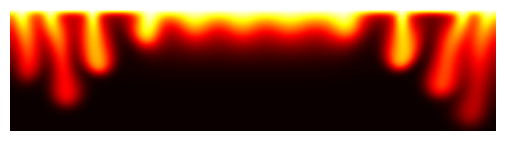

# LUCiFEx

Welcome to the ***Linearized Convection in FEniCSx*** package! 

Development has primarily been motivated by the numerical study of 2D convection in porous media, however the tools developed are general-purpose and widely-applicable. For any queries, comments or feedback do not hesitate to email `grp39@cam.ac.uk`.



## Documentation

See `demo` for notebooks and scripts, which are divided into three categories: `A` (applications to PDEs from fluid mechanics and porous media), `N` (numerical methods for solving time-dependent PDEs) and `T` (technical details and testing of the `lucifex` package). Fluid mechanics examples shown in `demo` include:
* Darcy's equations (formulated in terms of either velocity and pressure $\textbf{u}$, $p$ or the streamfunction $\psi$)
* Navier-Stokes equations (formulated in terms of either velocity and pressure $\textbf{u}$, $p$ or the streamfunction and vorticity $\psi$, $\omega$) 
* Stokes equations
* advection-diffusion-reaction equations for the transport of solute and/or heat coupled to fluid flow
* stabilization methods for advection-dominated transport equations
* classic instability problems such as Rayleigh-Bénard convection and Saffman-Taylor fingering
* perturbations to the initial conditions of instability problems
* simulations on both Cartesian and non-Cartesian domains


## What does LUCiFEx do?

### Time-dependent quantities

A time-dependent finite element function 

$$u(\textbf{x},t)\approx\sum_ju_j(t)\xi_j(\textbf{x})$$

$$u(\textbf{x}, t\leq t^{n+1})\approx
\begin{bmatrix}
u^{n+1}(\textbf{x}) \\
u^n(\textbf{x}) \\
u^{n-1}(\textbf{x}) \\
\vdots
\end{bmatrix}$$

where $u^n(\textbf{x})=\sum_ju_j^n\xi_j(\textbf{x})$ and $u_j^n\approx u_j(t^n)$ is represented by the `FunctionSeries` object

```python
u = FunctionSeries(function_space, 'u', order, store)
```

and its future, present and past values $u^{n+1}, u^n, u^{n-1}, \dots$ as far back as specified by `order` are accessed as
```
u[+1], u[0], u[-1], ...
```

If held in memory in accordance with the `store` parameter passed to `FunctionSeries`, the sequences $[u^0(\textbf{x}), u^1(\textbf{x}), \dots]$ and $[t^0, t^1, \dots]$ are acessed as
```
u.series
u.time_series
```

Time-dependent constants and expressions are similarly implemented by `ConstantSeries` and `ExprSeries`.

### Finite differences in time

`FiniteDifference` operators act on time-dependent quantities to produce finite-difference discretizations. For example, the second-order Adams-Bashforth discretization of $u(\textbf{x}, t)$ 

$$u(\textbf{x}, t^n)\approx \tfrac{3}{2}u^n - \tfrac{1}{2}u^{n-1}$$

is produced by the  `AB2` operator acting on a `FunctionSeries`
```python
AB2(u)
```

which is equivalent to manually writing out
```python
1.5 * u[0] - 0.5 * u[-1]
```

### Unified problem-solving interface

Partial differential equations (linear or linearized) to be solved can be of type `BoundaryValueProblem`, `InitialBoundaryValueProblem` or `EigenvalueProblem`. Algebraic expressions of finite element functions can be evaluated by solving a `ProjectionProblem` or an `InterpolationProblem`. Integral expressions are evaluated by solving a `CellIntegrationProblem` for area/volume intetrals or a `FacetIntegrationProblem` for line/surface integrals in 2D/3D.  Simple sumerical expressions may be evaluated by solving an `EvaluationProblem`. 

### Abstraction and composition

The design of `lucifex` encourages where possible abstraction over a PDE's domain, initial conditions, boundary conditions and constitutive relations. An emphasis on functions and a functional style of programming helps to create code that is flexible and reusable.

### Time-dependent boundary conditions

Dirichlet, Neumann, Robin and periodic conditions are specified by `BoundaryConditions`. The boundary condition's value of type `Function`, `Constant` or `Expr` can be updated in the time-stepping loop to implement a time-dependent bundary condition. 

### Time-dependent simulation

A time-dependent simulation is in effect a sequence of (linear or linearized) problems to be solved sequentially, over and over again in a time-stepping loop. Given the sequence of problems `solvers`, time  `t` and timestep `dt`, a simulation object is defined as

```python
simulation = Simulation(solvers, t, dt)
```

The `configure_simulation` decorator functions can be used to customise the configuration of a simulation.

Integration over time is performed by the `integrate` routine

```python
integrate(simulation, n_stop, t_stop, stoppers=...)
```

and conditions for stopping the integration can be specified by `n_stop`, `t_stop` and `stoppers`.

In a script designed to be run from the command line, the `integrate_from_cli` routine can instead be used with a function `simulation_factory` that returns a `Simulation` object

```python
integrate_from_cli(simulation_factory)
```

to create a command line interface into which arguments for configuring, creating and integrating the simulation can be passed.

### Postprocessing

The `grid` function converts Cartesian meshes and finite element functions defined on Cartesian meshes into `numpy` arrays in order to facilitate further postprocessing within the ecosystem of scientific Python packages (e.g. `scipy` and `matplotlib`).

```
x_axis, y_axis = grid(mesh)
u_grid = grid(u)
```

Applying the decorator functions `postprocess` and `co_postprocess` to functions acting on simulation data (e.g. to create a plot) enables them to be called using a convenient short-hand syntax, avoiding the need to explicitly load data in advance and write repetitive I/O routines. They furthermore enable the batch-postprocessing of an ensemble of simulation directories in which each individual directory has the same stucture (e.g. the `FunctionSeries` object `u` has been written to the same filename with the same object name).

## Installation (macOS)

Please note that `LUCiFEx` is a research code still under active development.

`git clone https://github.com/george-poole/LUCiFEx.git`

See `conda` directory for files to recreate Conda environment. To create a Conda environment named `lucifex`, first do `conda create -n lucifex` followed `conda activate lucifex` and then one of

* `conda install --file conda_explicit.txt` <br>
(requirements file created by `conda list --explicit > conda_explicit.txt`)

* `conda install x --file conda.txt` <br>
(requirements file created by `conda list > conda.txt`)

or do

* `conda env create --name lucifex -f conda_from_history.yml` <br>
(environment file created by `conda env export --from-history > conda_from_history.yml`)

* `conda env create --name lucifex -f conda.yml` <br>
(environment file created by `conda env export > conda.yml`)

Finally `conda activate lucifex` and `pip install .` (or `pip install -e .` for editable mode).

## Further work

These features remain to be implemented as part of ongoing development:

+ update to latest version of `fenicsx` (currently on 0.6.0) and Python (currently on 3.10.12)
+ parallelisation with `mpi4py`
+ nested solvers
+ preconditioned solvers
+ nonlinear solvers
+ more documentation and testing

## What does LUCiFEx *not* do?

These features are outside the scope of current development, but could be of interest in the future:

+ adaptive mesh refinement
+ time-dependent domains and boundaries
+ time-stepping with Runge-Kutta methods