# Gallery

## Convection

<table>
    <tr>
    <td>
    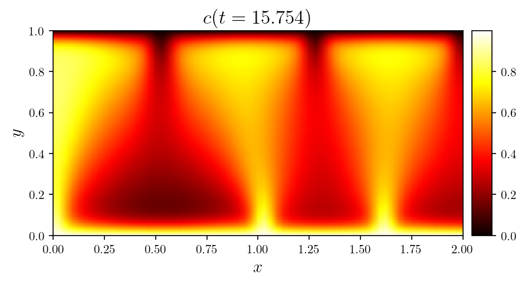
    <a href="./notebooks/P05_convection/C01.1_darcy_rayleigh_benard_rectangle.html">Rayleigh-Bénard convection of a Darcy fluid in a porous rectangle</a> 
    </td>
<td>
    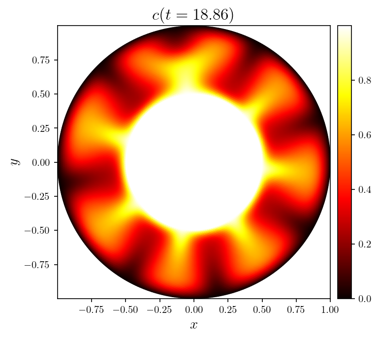
    <a href="./notebooks/P05_convection/C01.2_darcy_rayleigh_benard_annulus.html">Rayleigh-Bénard convection of a Darcy fluid in a porous annulus</a> 
    </td>
<td>
    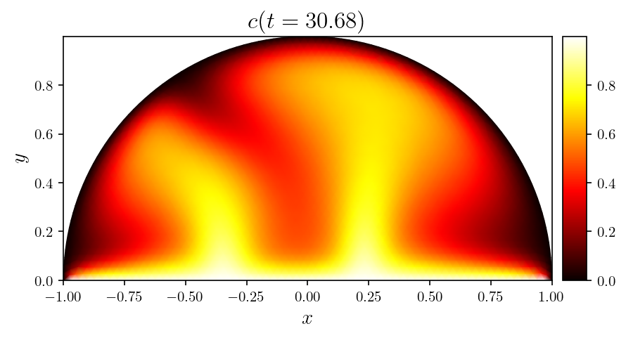
    <a href="./notebooks/P05_convection/C01.3_darcy_rayleigh_benard_semicircle.html">Rayleigh-Bénard convection in a porous semicircle</a> 
    </td>
    </tr>
<tr>
    <td>
    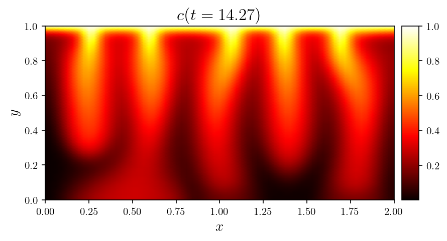
    <a href="./notebooks/P05_convection/C01.4_darcy_evolving_isotropic.html">Evolving convection of a Darcy fluid in an isotropic porous rectangle</a> 
    </td>
<td>
    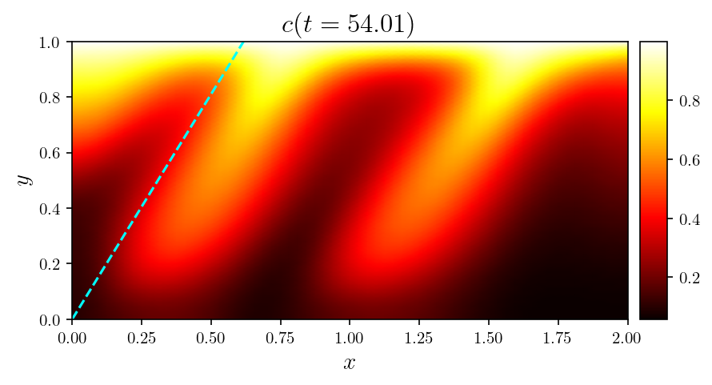
    <a href="./notebooks/P05_convection/C01.5_darcy_evolving_crossbedded.html">Evolving convection of a Darcy fluid in a cross-bedded porous rectangle</a> 
    </td>
<td>
    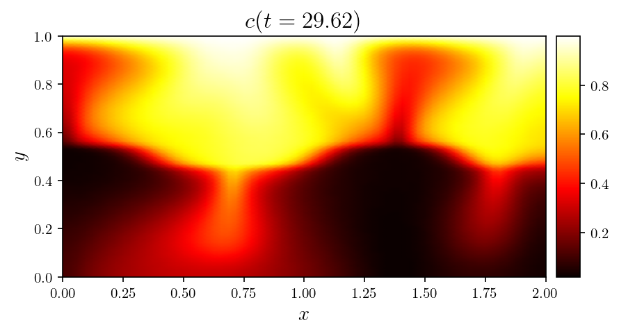
    <a href="./notebooks/P05_convection/C01.6_darcy_evolving_layered.html">Evolving convection of a Darcy fluid in a layered porous rectangle</a> 
    </td>
    </tr>
<tr>
    <td>
    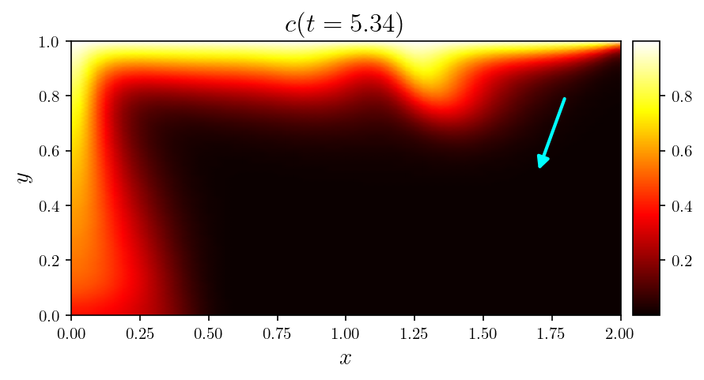
    <a href="./notebooks/P05_convection/C01.7_darcy_evolving_inclined.html">Evolving convection of a Darcy fluid in an inclined porous rectangle</a> 
    </td>
<td>
    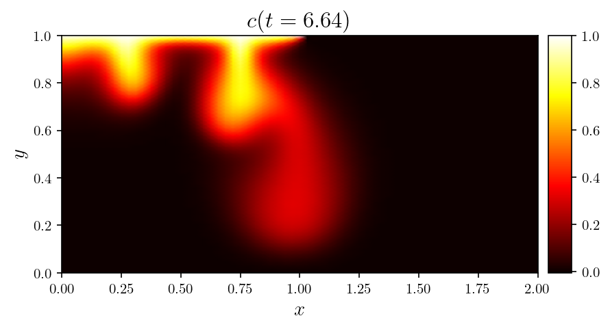
    <a href="./notebooks/P05_convection/C01.8_darcy_elder.html">Elder convection of a Darcy fluid in a porous rectangle</a> 
    </td>
<td>
    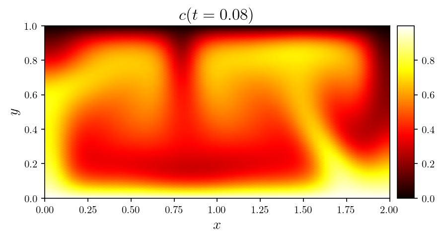
    <a href="./notebooks/P05_convection/C02.1_stokes_rayleigh_benard_isoviscous.html">Rayleigh-Bénard convection of an isoviscous Stokes fluid</a> 
    </td>
    </tr>
<tr>
    <td>
    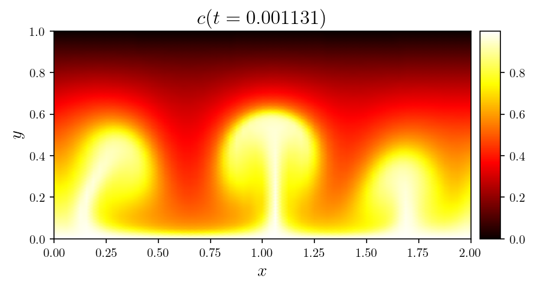
    <a href="./notebooks/P05_convection/C02.2_stokes_rayleigh_benard_nonisoviscous.html">Rayleigh-Bénard convection of a non-isoviscous Stokes fluid</a> 
    </td>
<td>
    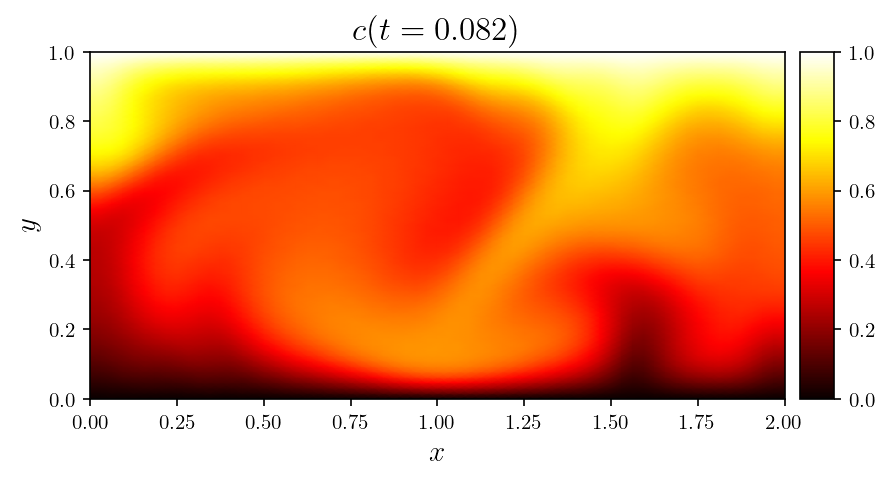
    <a href="./notebooks/P05_convection/C03.1_navier_stokes_thermosolutal.html">Thermosolutal convection of a Navier-Stokes fluid in a rectangle</a> 
    </td>
<td>
    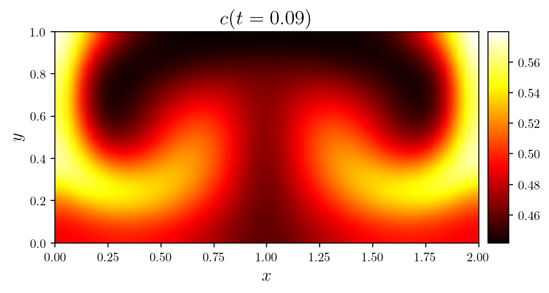
    <a href="./notebooks/P05_convection/C03.2_navier_stokes_rayleigh_taylor.html">Rayleigh-Taylor instability of a Navier-Stokes fluid in a rectangle</a> 
    </td>
    </tr>
<tr>
    <td>
    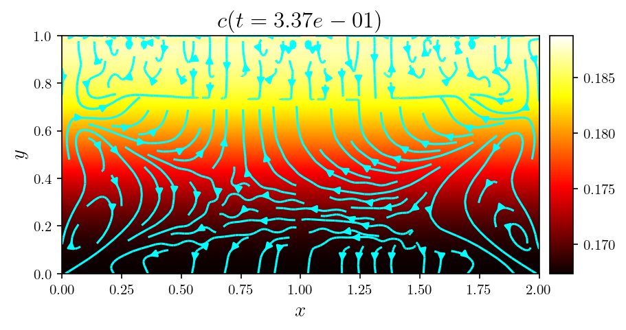
    <a href="./notebooks/P05_convection/C03.3_navier_stokes_marangoni.html">Marangoni convection of a Navier-Stokes fluid in a rectangle</a> 
    </td>
<td>
    
    <a href="./notebooks/P05_convection/C04.1_darcy_brinkman_rayleigh_taylor.html">Rayleigh-Taylor instability of a Darcy-Brinkman fluid in a partially porous rectangle</a> 
    </td>
<td>
    
    <a href="./notebooks/P05_convection/C04.2_darcy_brinkman_rayleigh_benard.html">Rayleigh-Bénard convection of a Darcy-Brinkman fluid in a partially porous rectangle</a> 
    </td>
    </tr>
    </table>

## Fluids

<table>
    <tr>
    <td>
    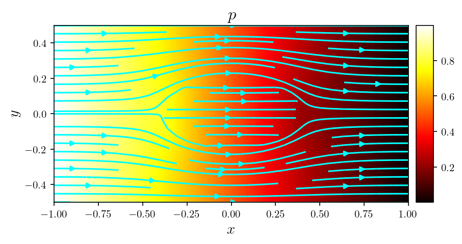
    <a href="./notebooks/P03_fluids/F01.1_darcy_lens.html">Flow of a Darcy fluid through a lens of low permeability</a> 
    </td>
<td>
    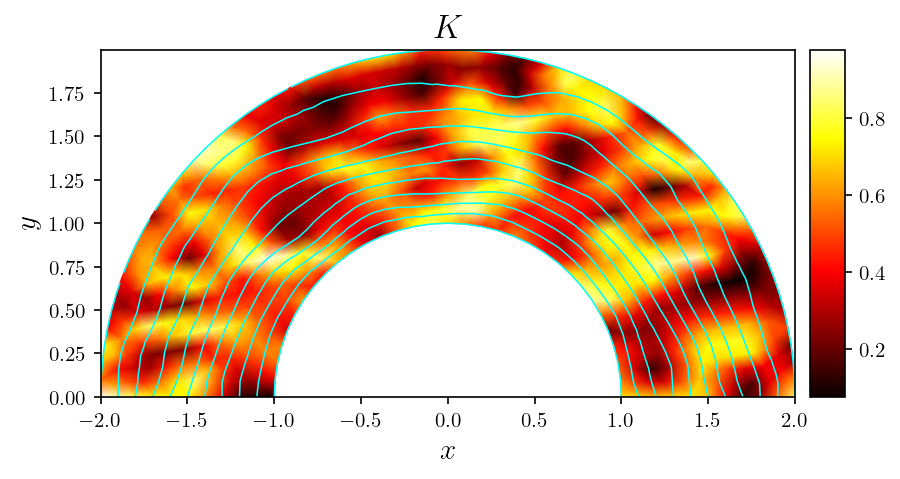
    <a href="./notebooks/P03_fluids/F01.2_darcy_anticline.html">Flow of a Darcy fluid across an anticline of heterogeneous permeability</a> 
    </td>
<td>
    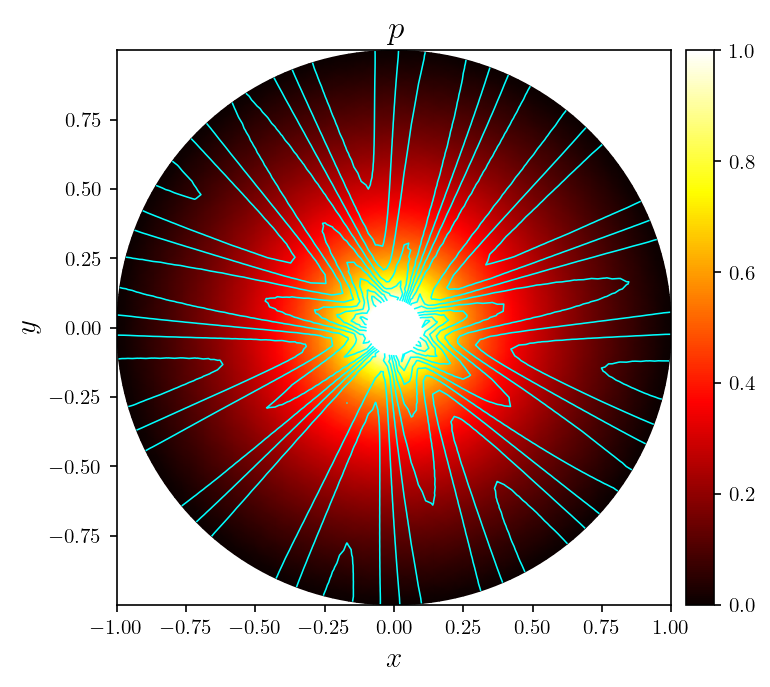
    <a href="./notebooks/P03_fluids/F01.3_darcy_annulus.html">Flow of a Darcy fluid in an annulus</a> 
    </td>
    </tr>
<tr>
    <td>
    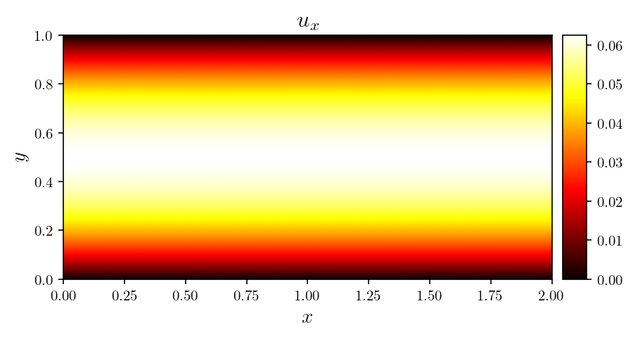
    <a href="./notebooks/P03_fluids/F02.1_stokes_channel.html">Flow of a Stokes fluid in a pressure-driven channel</a> 
    </td>
<td>
    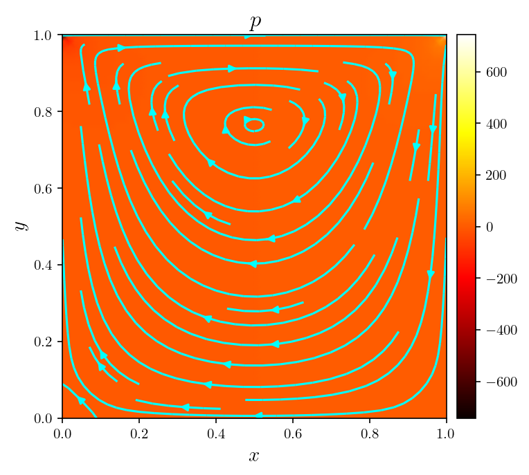
    <a href="./notebooks/P03_fluids/F02.2_stokes_cavity.html">Flow of a Stokes fluid in a lid-driven cavity</a> 
    </td>
<td>
    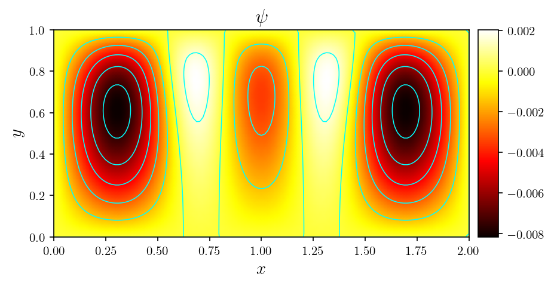
    <a href="./notebooks/P03_fluids/F02.3_stokes_forced.html">Flow of a Stokes fluid with vertical forcing</a> 
    </td>
    </tr>
<tr>
    <td>
    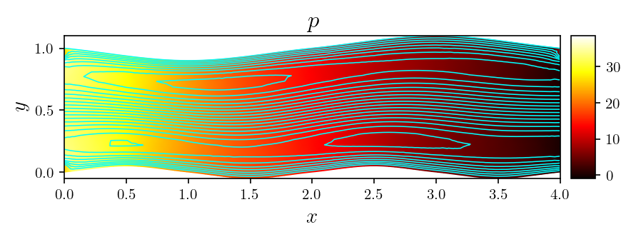
    <a href="./notebooks/P03_fluids/F02.4_stokes_corrugated.html">Flow of a Stokes fluid in a corrugated channel</a> 
    </td>
<td>
    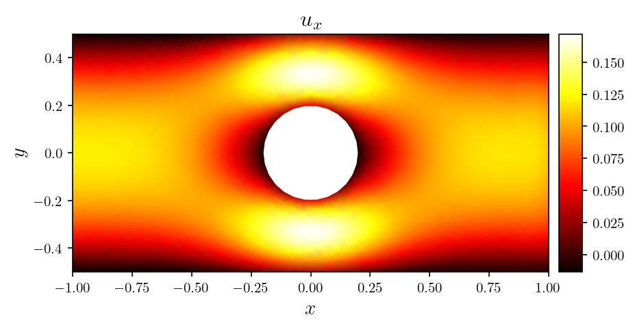
    <a href="./notebooks/P03_fluids/F03.1_navier_stokes_obstacle.html">Flow of Navier-Stokes fluid past a circular obstacle</a> 
    </td>
<td>
    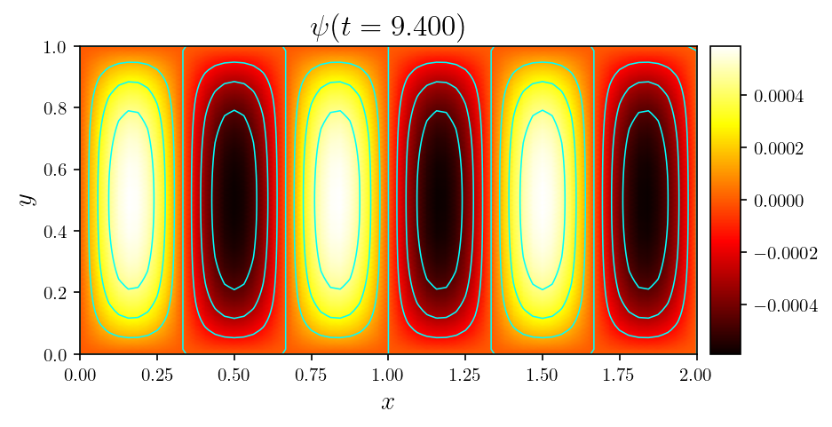
    <a href="./notebooks/P03_fluids/F03.2_navier_stokes_forced.html">Flow of a Navier-Stokes fluid with vertical forcing</a> 
    </td>
    </tr>
    </table>

## Transport

<table>
    <tr>
    <td>
    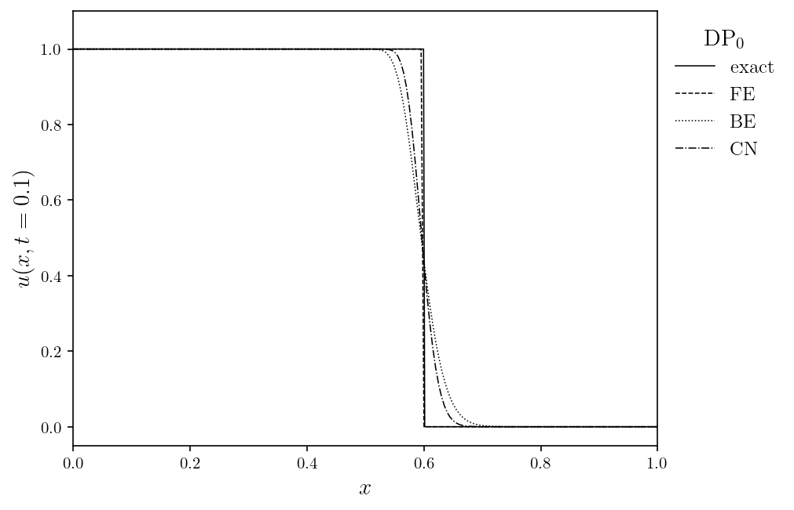
    <a href="./notebooks/P04_transport/T01.1_dg_advection_interval_step.html">DG advection of a step in an interval</a> 
    </td>
<td>
    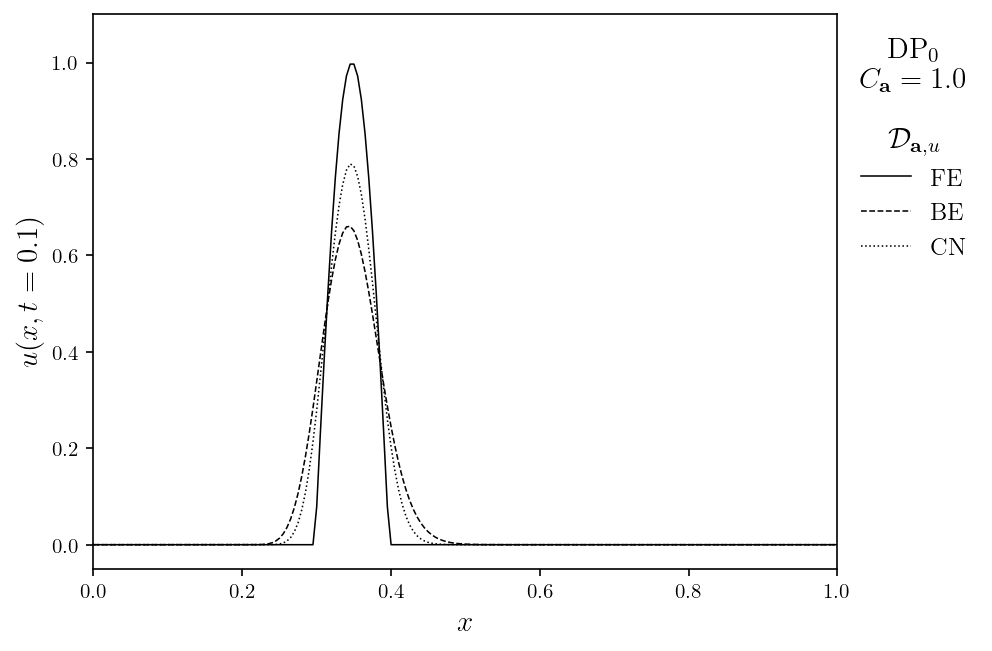
    <a href="./notebooks/P04_transport/T01.2_dg_advection_interval_cosine.html">DG advection of a cosine in an interval</a> 
    </td>
<td>
    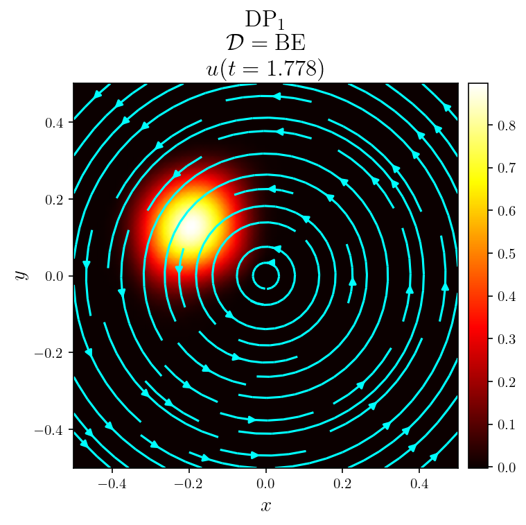
    <a href="./notebooks/P04_transport/T01.3_dg_advection_rectangle_cone.html">DG advection of a rotating cone in a rectangle</a> 
    </td>
    </tr>
<tr>
    <td>
    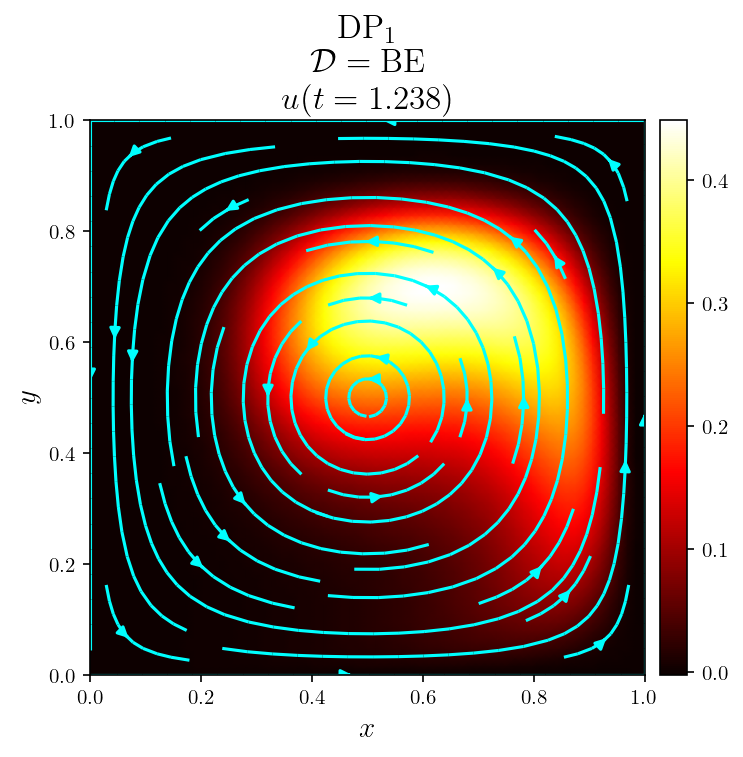
    <a href="./notebooks/P04_transport/T01.4_dg_advection_rectangle_vortex.html">DG advection with a vortex in a rectangle</a> 
    </td>
<td>
    
    <a href="./notebooks/P04_transport/T02.1_dg_steady_advection_diffusion_interval.html">DG steady advection-diffusion in an interval</a> 
    </td>
<td>
    
    <a href="./notebooks/P04_transport/T02.2_dg_steady_advection_diffusion_rectangle.html">DG steady advection-diffusion in a rectangle</a> 
    </td>
    </tr>
<tr>
    <td>
    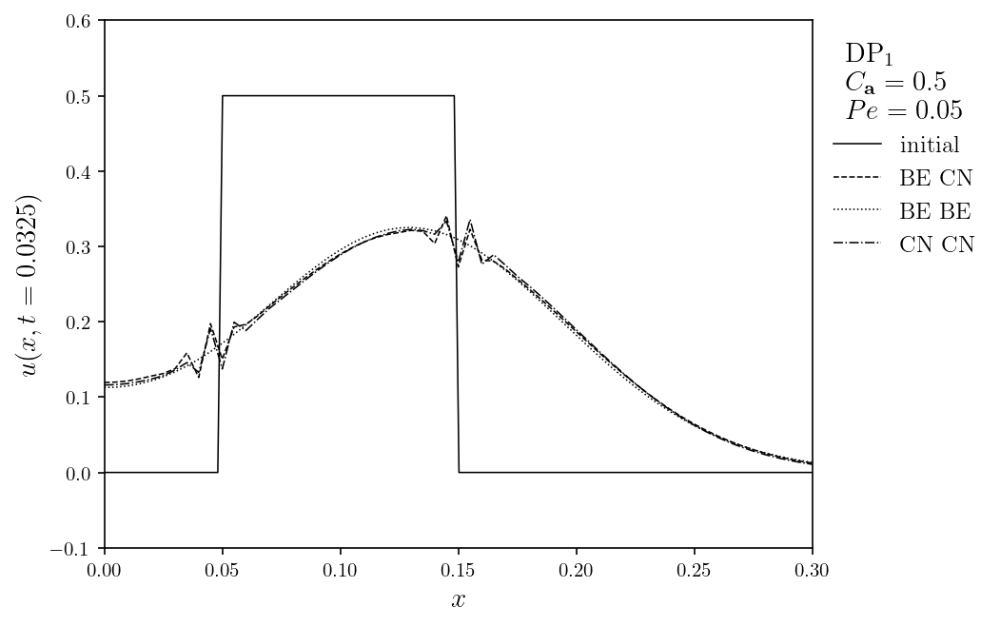
    <a href="./notebooks/P04_transport/T03.1_dg_advection_diffusion_interval.html">DG advection-diffusion of a tophat on an interval</a> 
    </td>
<td>
    
    <a href="./notebooks/P04_transport/T03.2_dg_advection_diffusion_rectangle.html">DG advection-diffusion in a rectangle</a> 
    </td>
<td>
    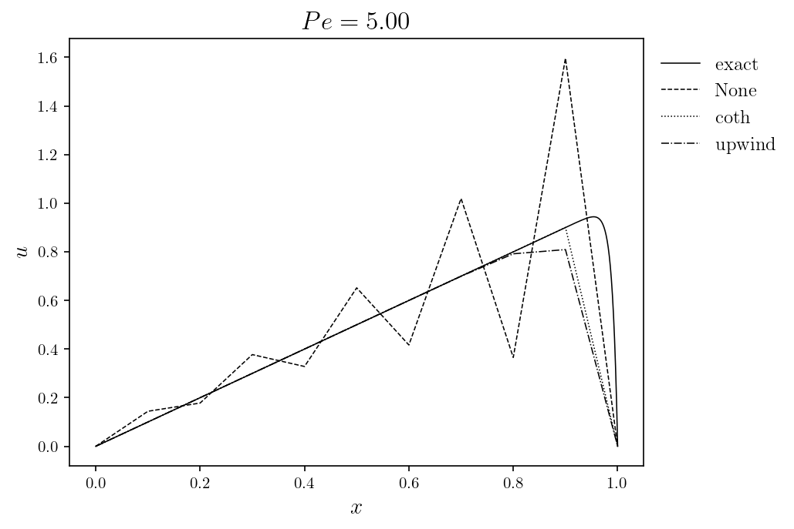
    <a href="./notebooks/P04_transport/T04.1_supg_steady_advection_diffusion_interval.html">SUPG steady advection-diffusion in an interval</a> 
    </td>
    </tr>
<tr>
    <td>
    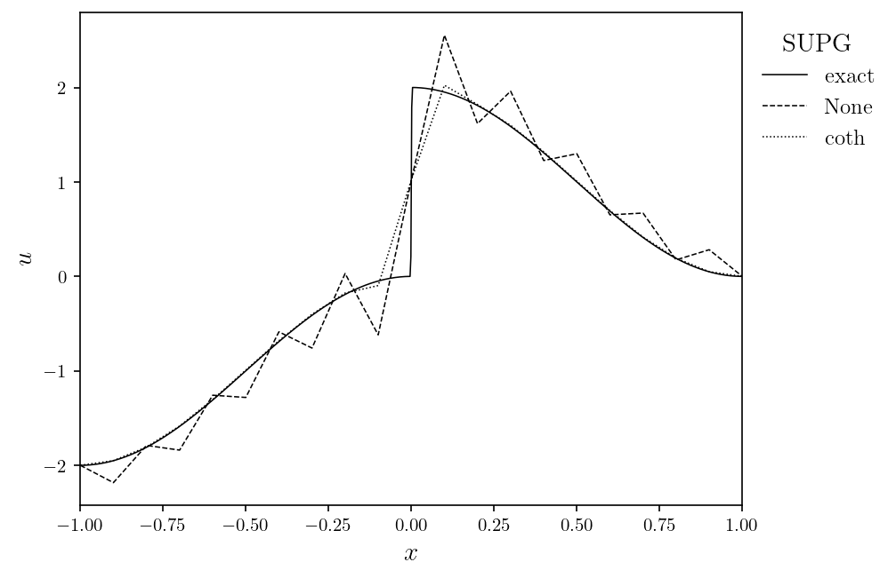
    <a href="./notebooks/P04_transport/T04.2_supg_steady_advection_diffusion_hemker.html">SUPG steady advection-diffusion of the Hemker problem</a> 
    </td>
<td>
    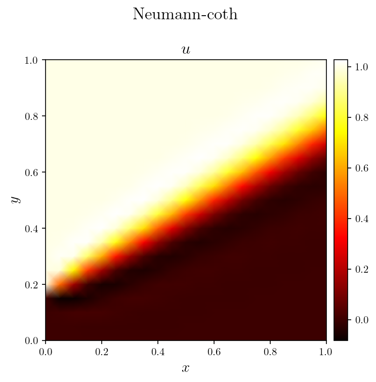
    <a href="./notebooks/P04_transport/T04.3_supg_steady_advection_diffusion_rectangle.html">SUPG steady advection-diffusion with a skew velocity</a> 
    </td>
<td>
    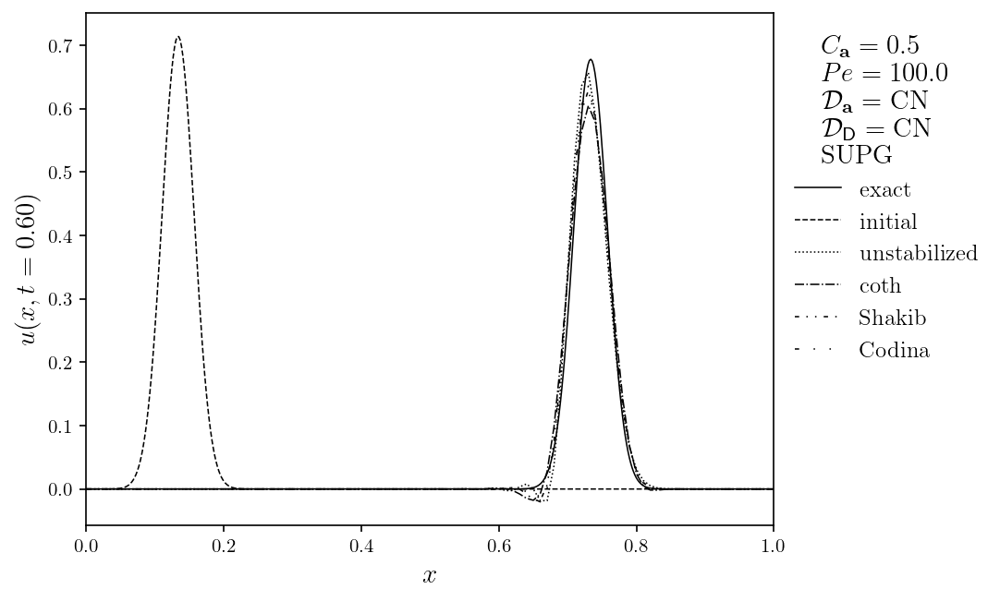
    <a href="./notebooks/P04_transport/T05.1_supg_advection_diffusion_interval.html">SUPG advection-diffusion of a Gaussian in an interval</a> 
    </td>
    </tr>
<tr>
    <td>
    
    <a href="./notebooks/P04_transport/T05.2_supg_advection_diffusion_rectangle.html">SUPG advection-diffusion of a rotating pulse in a rectangle</a> 
    </td>
    </tr>
    </table>

## Introductory

<table>
    <tr>
    <td>
    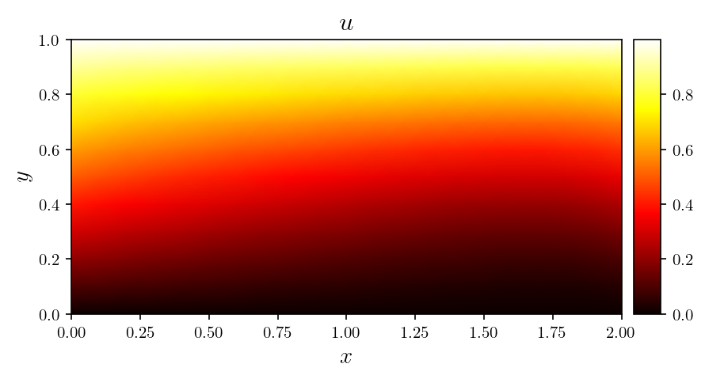
    <a href="./notebooks/P02_introductory/I01.1_poisson_rectangle.html">Poisson equation in a rectangle</a> 
    </td>
<td>
    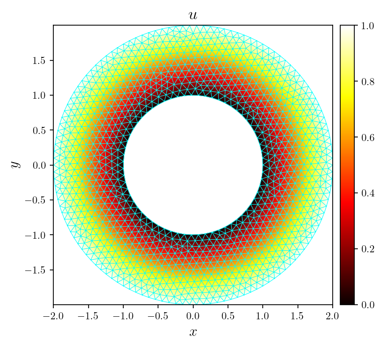
    <a href="./notebooks/P02_introductory/I01.2_poisson_annulus.html">Poisson equation on an annulus</a> 
    </td>
<td>
    
    <a href="./notebooks/P02_introductory/I01.3_poisson_vector.html">Vector Poisson equation in a rectangle</a> 
    </td>
    </tr>
<tr>
    <td>
    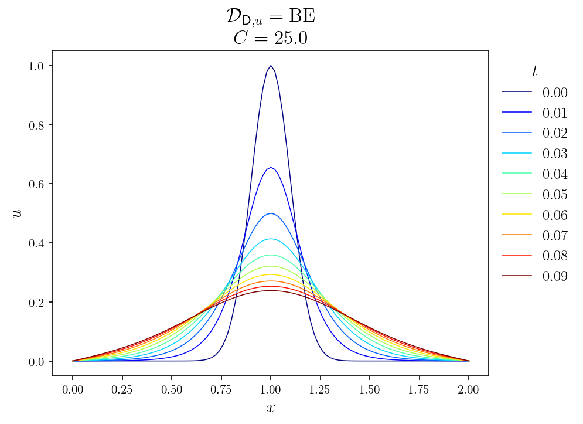
    <a href="./notebooks/P02_introductory/I02.1_diffusion_interval.html">Diffusion of a Gaussian in an interval</a> 
    </td>
<td>
    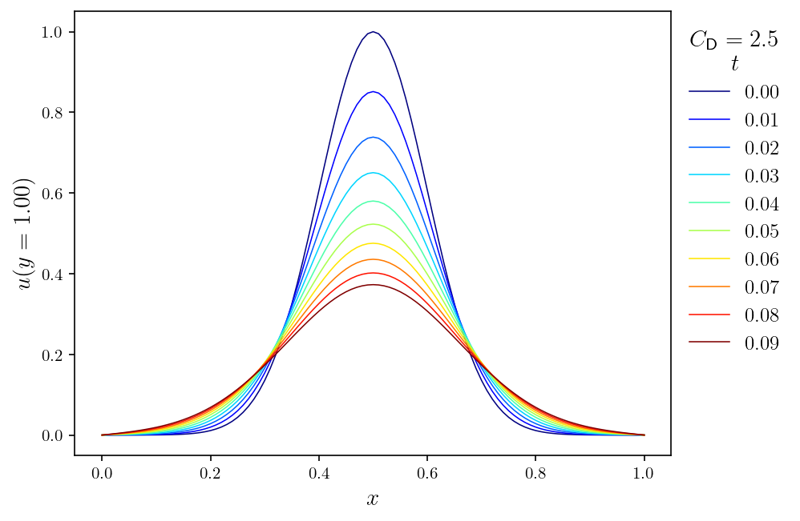
    <a href="./notebooks/P02_introductory/I02.2_diffusion_rectangle.html">Diffusion of a Gaussian in a rectangle</a> 
    </td>
<td>
    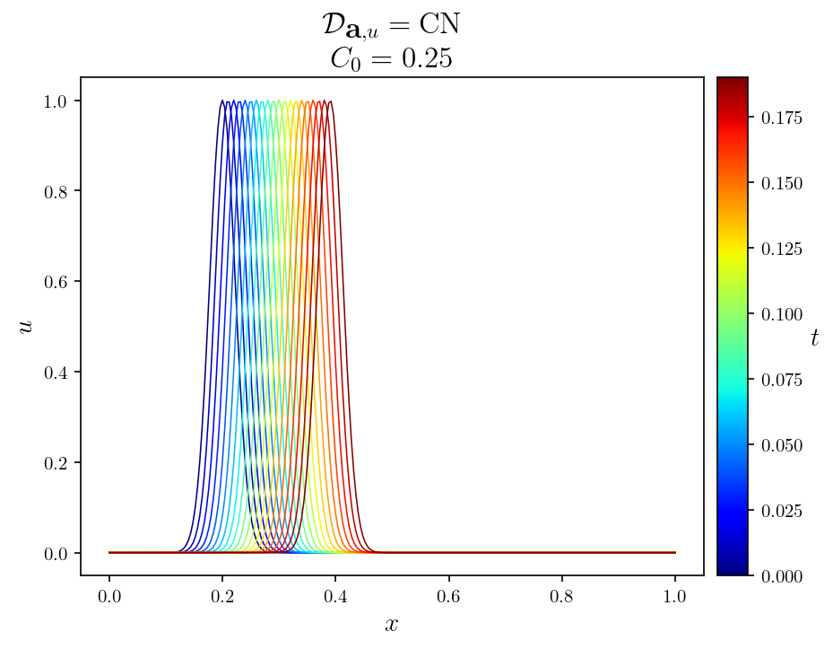
    <a href="./notebooks/P02_introductory/I03.1_advection_interval.html">Advection of a Gaussian in an interval</a> 
    </td>
    </tr>
<tr>
    <td>
    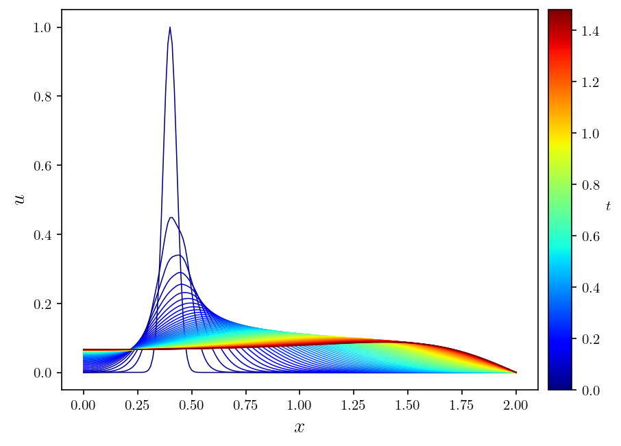
    <a href="./notebooks/P02_introductory/I04.1_advection_diffusion_interval.html">Advection-diffusion of a Gaussian in an interval</a> 
    </td>
<td>
    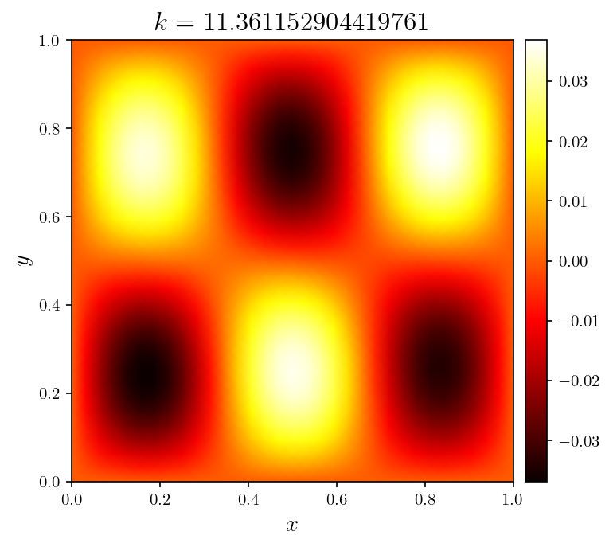
    <a href="./notebooks/P02_introductory/I05.1_helmholtz_evp.html">Helmholtz eigenvalue problem in a rectangle</a> 
    </td>
<td>
    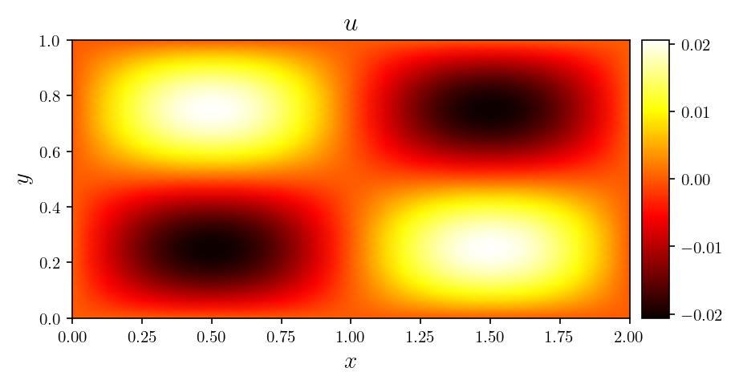
    <a href="./notebooks/P02_introductory/I05.2_helmholtz_bvp.html">Helmholtz boundary value problem in a rectangle</a> 
    </td>
    </tr>
<tr>
    <td>
    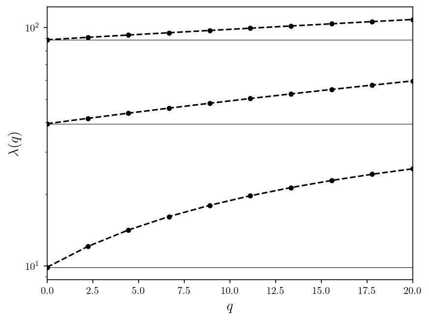
    <a href="./notebooks/P02_introductory/I06.1_mathieu_evp.html">Mathieu eigenvalue problem in an interval</a> 
    </td>
<td>
    
    <a href="./notebooks/P02_introductory/Ixx.1_wave_interval.html">Wave equation in an interval</a> 
    </td>
    </tr>
    </table>
